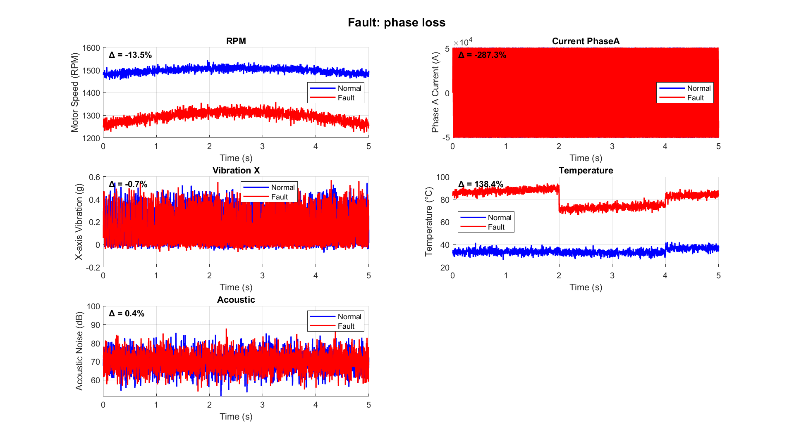
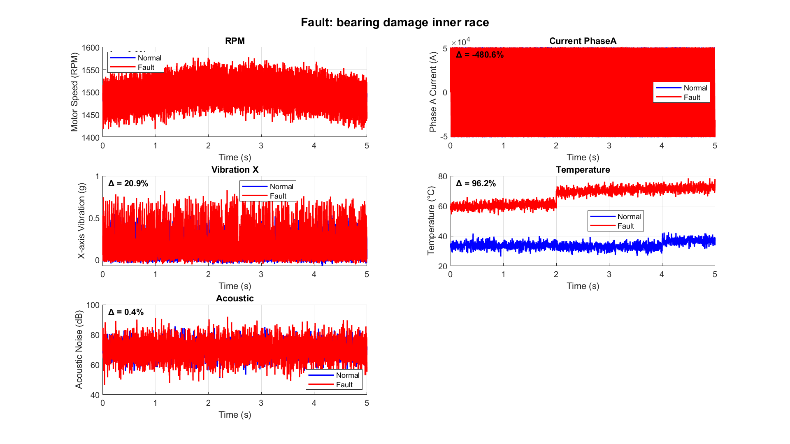
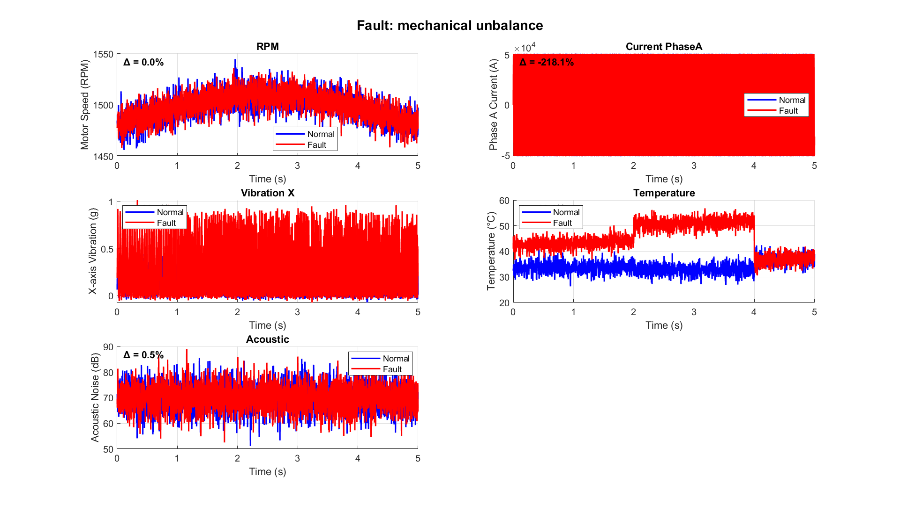

# Induction Motor Fault Diagnosis Simulation


A comprehensive MATLAB simulation designed to model the dynamic behavior of an industrial induction motor under various fault conditions. This project generates a high-fidelity, labeled dataset intended for developing and testing predictive maintenance and Fault Detection and Diagnosis (FDD) algorithms.

[cite_start]This simulation was developed as part of a summer internship project at the **Delhi Metro Rail Corporation (DMRC)** [cite: 1, 2, 7] [cite_start]and is based on the specifications of a 37kW tunnel booster fan motor[cite: 149].

## 📋 Key Features

* [cite_start]**Dynamic Motor Modeling**: Simulates a 37kW, 3-phase induction motor[cite: 149].
* [cite_start]**Multiple Fault Scenarios**: Generates data for normal operation and 11 distinct electrical and mechanical fault types[cite: 149].
* [cite_start]**Multi-Sensor Data Generation**: Creates time-series data for 3-phase currents and voltages, RPM, temperature, 3-axis vibration, and acoustic noise[cite: 147].
* [cite_start]**Automated Visualization**: Automatically produces comparison plots for each fault against the normal baseline[cite: 149].
* [cite_start]**Statistical Summary**: Outputs a CSV file with key statistical metrics (mean, std, min, max) for all simulated conditions[cite: 149].

## 🔩 Simulated Fault Conditions

[cite_start]The simulation generates data for the following 12 conditions (1 normal + 11 faults)[cite: 149]:

1.  Normal Operation
2.  Broken Rotor Bar
3.  Bearing Damage (Outer Race)
4.  Bearing Damage (Inner Race)
5.  Bearing Damage (Rolling Element)
6.  Stator Winding Short
7.  Stator Winding Open
8.  Voltage Unbalance
9.  Rotor Eccentricity
10. Phase Loss
11. Belt Misalignment
12. Mechanical Unbalance

## 📂 Project Structure

After running the simulation, the following structure will be created:

```
.
├── fault_comparisons/
│   ├── bearing_damage_inner_race_comparison.png
│   ├── broken_rotor_bar_comparison.png
│   └── ... (plots for all 11 faults)
│
├── motor_fault_data/
│   ├── normal_operation.csv
│   ├── bearing_damage_inner_race.csv
│   └── ... (data for all 12 conditions)
│
├── fault_statistics.csv
└── Sim7.m
```

[cite_start]The CSV files in `motor_fault_data/` contain the following columns[cite: 146, 147]:
`Time, RPM, Current_PhaseA, Current_PhaseB, Current_PhaseC, Voltage_PhaseA, Voltage_PhaseB, Voltage_PhaseC, Temperature, Vibration_X, Vibration_Y, Vibration_Z, Acoustic`

## 🚀 How to Run

1.  Clone this repository to your local machine.
2.  Open MATLAB.
3.  [cite_start]Run the `Sim7.m` script[cite: 149].

[cite_start]The script will automatically simulate all conditions and generate the `motor_fault_data`, `fault_comparisons`, and `fault_statistics.csv` files in the project directory[cite: 149].

## 📊 Example Visualizations

The simulation provides clear visual comparisons between normal and faulty states.

### Phase Loss Fault
[cite_start]A phase loss fault shows a dramatic drop in motor RPM and a significant increase in temperature[cite: 1, 54, 138].



### Bearing Damage (Inner Race)
[cite_start]Inner race bearing damage introduces periodic, high-frequency components into the vibration signal and increases operating temperature[cite: 109, 132].



### Mechanical Unbalance
[cite_start]Mechanical unbalance significantly increases the amplitude of vibrations at the motor's running speed (1x RPM)[cite: 2, 110, 137].



## Acknowledgements

[cite_start]This work was conducted as part of the Summer Internship Program (27th May '25 to 24th June '25) at the Delhi Metro Rail Corporation (DMRC), in partial fulfillment of the requirements for the Bachelor of Technology degree from the National Institute of Technology, Hamirpur[cite: 1, 2, 7, 13].

## 📜 License

This project is licensed under the MIT License. See the `LICENSE` file for details.
